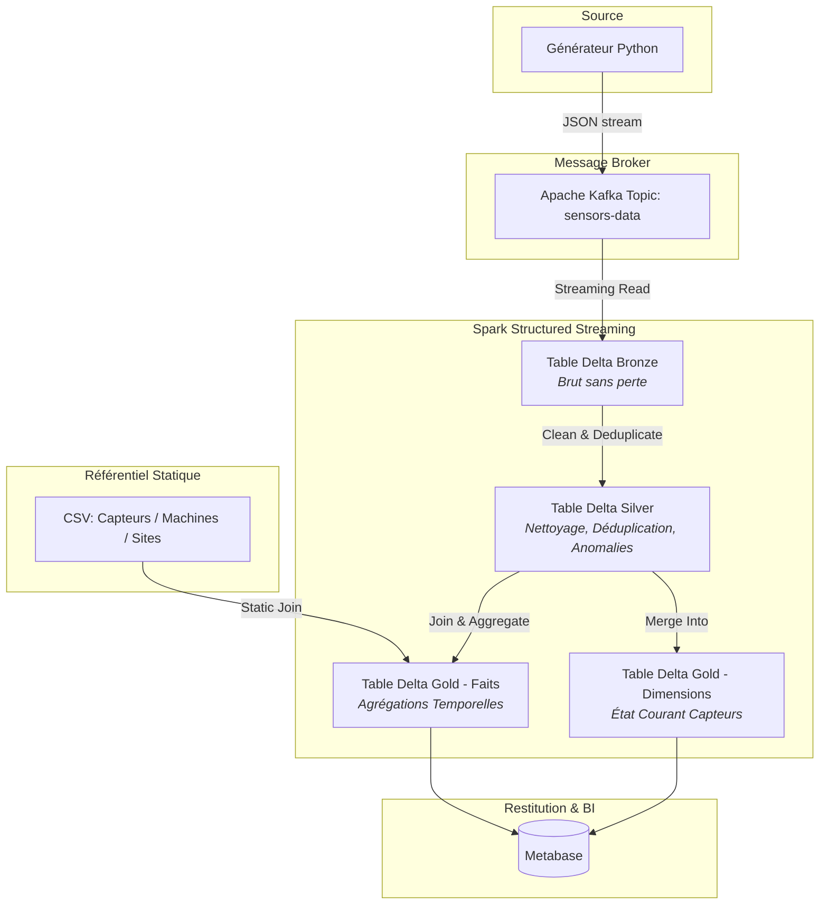

# Pipeline Big Data Temps Réel — Monitoring de Capteurs Industriels

Ce projet implémente un pipeline de traitement de données temps réel en **architecture Kappa** pour monitorer une flotte de capteurs industriels. 

---

## 📄 Présentation du Cas d'Usage
Le système simule un site industriel composé de plusieurs dizaines de capteurs (mesurant la température, la vibration et la pression) répartis sur différentes machines. Chaque capteur émet une mesure toutes les 1 à 3 secondes.

### Schéma des événements Kafka (JSON)
```json
{
  "event_id": "evt-9f3a1c2d",
  "capteur_id": "cpt-042",
  "machine_id": "m-07",
  "site_id": "site-lyon",
  "type_mesure": "temperature",
  "valeur": 78.4,
  "unite": "celsius",
  "qualite_signal": 0.97,
  "batterie_pourcentage": 63,
  "timestamp": "2026-07-08T10:15:32.104Z"
}
```

---

## 🛠️ Architecture du Pipeline



### Choix techniques de modélisation
*   **Format des tables :** Delta Lake (support ACID, Time Travel, `MERGE INTO`). Toutes les tables Bronze/Silver/Gold vivent sous `./lakehouse/` (bind-mount partagé entre `spark-master` et `spark-worker`).
*   **Broker :** Kafka en mode **KRaft mono-nœud** (sans Zookeeper) — plus léger, adapté au laptop 16 Go. Topic `sensors-data`, 3 partitions, clé = `capteur_id` (ordre garanti par capteur).
*   **Restitution BI :** Delta reste la **source de vérité** ; le job Gold recopie le star-schema dans un **Postgres de service** que **Metabase** lit nativement (driver fiable, pas de dépendance à un connecteur Spark SQL fragile).
*   **Partitionnement (recommandé aux jobs) :** partitionner Bronze/Silver par `date_ingestion` (ou `site_id`) pour limiter la ré-écriture ; Gold agrégé reste petit et non partitionné. *(choix final à la main des lots Bronze/Silver)*

> 📄 **Le contrat d'interface complet (noms de topics, chemins, ports, connexions) est dans [`INFRA.md`](INFRA.md).**

---

## 🚀 Guide de Lancement

### Prérequis
*   Docker & Docker Compose v2 (tout tourne en conteneurs — aucun Spark/Java local requis).
*   Python 3.10+ uniquement si vous voulez regénérer le référentiel CSV hors conteneur.

### 1. Démarrage de l'infrastructure
```bash
docker compose up -d --build
```
Démarre, avec ordre géré par healthchecks : **Kafka** (KRaft) + création du topic, **Kafka UI**, **Spark** (master + worker, Delta/Kafka/JDBC pré-installés), **Postgres** (serving layer), **Metabase**.

| Service        | URL / accès              | Rôle                                  |
|----------------|--------------------------|---------------------------------------|
| Kafka          | `localhost:29092` (hôte) / `kafka:9092` (conteneurs) | Bus d'événements |
| Kafka UI       | http://localhost:8080    | Inspection du topic / messages        |
| Spark master   | http://localhost:8081    | Cluster + soumission des jobs         |
| Spark worker   | http://localhost:8082    | Exécuteurs                            |
| Spark job UI   | http://localhost:4040    | Suivi du job streaming en cours       |
| Postgres       | `localhost:5432` (`warehouse`/`warehouse`) | Serving layer (Gold → BI)   |
| Metabase       | http://localhost:3000    | Dashboard BI                          |

### 2. Référentiel Statique (déjà généré et committé)
Les 3 CSV sont dans [`data/`](data/), **cohérents par construction** avec le flux
(3 sites · 9 machines · 50 capteurs, générés depuis `generator/topology.py`).
Ils sont montés en lecture seule dans Spark sous `/opt/data/`.
Pour les regénérer : `make referentiel` (ou `python generator/build_referentiel.py`).

### 3. Lancement du Générateur d'Événements
```bash
# Simple (paramètres par défaut : 50 capteurs, 5% d'anomalies, 1-3 s)
docker compose --profile generator up -d generator
docker compose logs -f generator          # voir le débit

# Ou en réglant les paramètres via variables d'environnement dans .env
```
Le générateur (`generator/generator.py`) est un **stand-in** au schéma imposé, à
remplacer par le générateur officiel le moment venu (point de contact : topic `sensors-data`).

### 4. Soumission des Jobs Spark
Delta/Kafka/JDBC sont déjà dans l'image (pas de `--packages`) :
```bash
docker compose exec spark-master spark-submit /opt/spark-apps/<votre_job>.py
```
Déposez vos scripts dans [`spark/apps/`](spark/apps/) (monté sous `/opt/spark-apps`).
Détails et exemples de code : [`spark/apps/README.md`](spark/apps/README.md).

---

## 📈 Preuves de Fonctionnement

### 1. Transit des données (Kafka ➔ Bronze ➔ Silver ➔ Gold)
*   **Kafka :** *(Insérer une capture d'écran du topic Kafka ou commande console consumer montrant les messages bruts)*
*   **Bronze (Brut) :** *(Copie d'écran ou commande montrant la structure et le contenu brut)*
*   **Silver (Filtré) :** *(Preuve de détection/marquage des anomalies, ex: température > 85°C)*
*   **Gold (Modélisé) :** *(Preuve du bon fonctionnement des agrégations et de la mise à jour de l'état courant)*

### 2. Fonctionnalités Delta Lake (Time Travel & Historique)
Sortie de la commande `DESCRIBE HISTORY` ou requête `VERSION AS OF` démontrant le fonctionnement du Time Travel :
```sql
-- Exemple de requête SQL de Time Travel
SELECT * FROM gold_sensor_state VERSION AS OF 1;
```
*(Insérer ici une preuve d'exécution réussie)*

### 3. Dashboard Metabase
*(Insérer une capture d'écran du dashboard Metabase montrant les KPIs en temps réel : nombre d'alertes par machine, moyenne de température glissante, état de la batterie des capteurs, etc.)*

---

## 🧠 Justifications Techniques

### Pourquoi l'architecture Kappa ?
*(Expliquer l'intérêt de n'avoir qu'un seul chemin de traitement temps réel pour ce cas d'usage sans couche batch séparée. Pourquoi le streaming est indispensable ici pour le monitoring industriel).*

### Gestion des Checkpoints
*(Décrire comment les checkpoints Spark Structured Streaming sont configurés et stockés pour garantir la tolérance aux pannes et le traitement "exactly-once").*

### Compaction des petits fichiers (Delta Optimization)
*(Expliquer le problème de surmultiplication des petits fichiers générés par le streaming continu et comment y remédier avec Delta, par exemple via OPTIMIZE et Auto-Compact).*

---

## ⚠️ Gestion des Incidents
*(Décrire ici un problème réel rencontré durant le développement : par exemple, un checkpoint corrompu, une erreur Out Of Memory (OOM) sur Spark, ou un problème de désynchronisation de schéma Delta Lake, et détailler comment vous l'avez résolu).*
