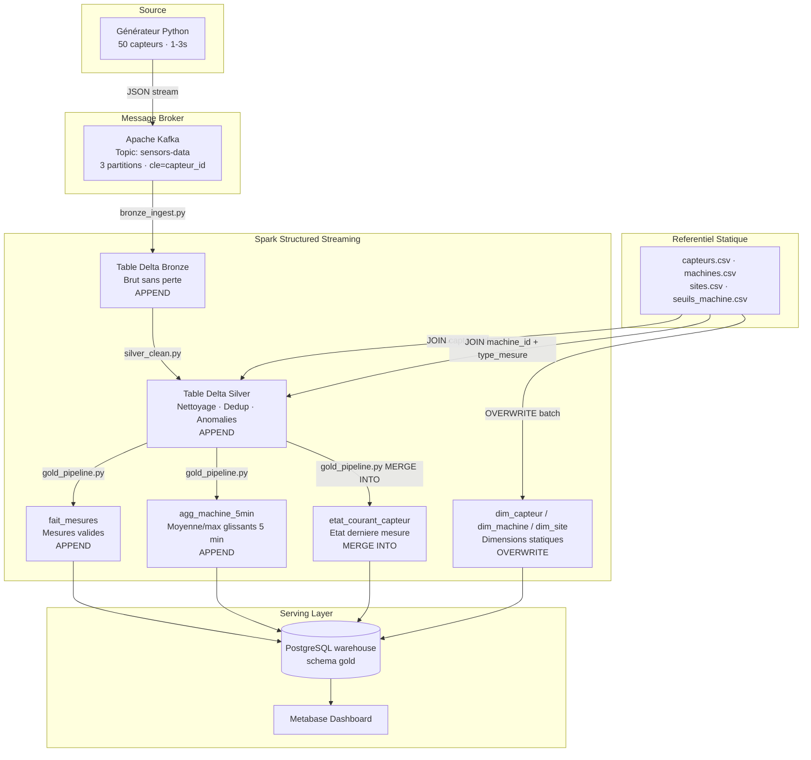
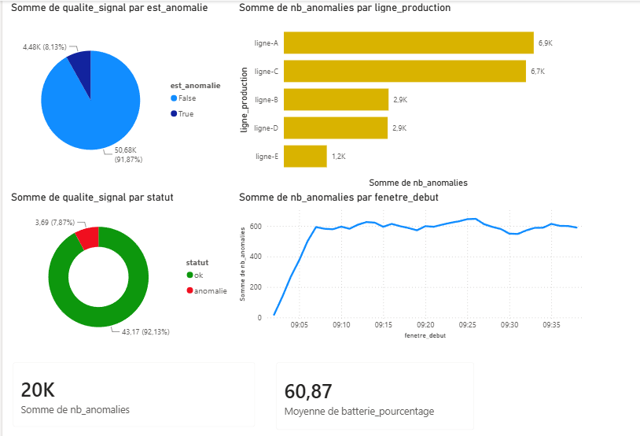

# Pipeline Big Data Temps Réel — Monitoring de Capteurs Industriels
Ce projet implémente un pipeline de traitement de données temps réel en **architecture Kappa** pour monitorer une flotte de capteurs industriels.

---

## 📄 Présentation du Cas d'Usage
Le système simule un site industriel composé de **50 capteurs** (température, vibration, pression) répartis sur **9 machines** et **3 sites**. Chaque capteur émet une mesure toutes les 1 à 3 secondes via Kafka, traitée en streaming par Spark Structured Streaming en trois couches Delta Lake (Bronze → Silver → Gold).

### Schéma des événements Kafka (JSON)
```json
{
  "event_id": "evt-9f3a1c2d",
  "capteur_id": "cpt-042",
  "machine_id": "m-07",
  "site_id": "site-lyon",
  "type_mesure": "temperature",
  "valeur": 78.4,
  "unite": "celsius",
  "qualite_signal": 0.97,
  "batterie_pourcentage": 63,
  "timestamp": "2026-07-08T10:15:32.104Z"
}
```

---

## 🛠️ Architecture du Pipeline



### Choix techniques de modélisation
- **Format des tables :** Delta Lake (ACID, Time Travel, `MERGE INTO`). Toutes les tables vivent sous `./lakehouse/` (bind-mount partagé entre `spark-master` et `spark-worker`).
- **Broker :** Kafka en mode **KRaft mono-nœud** (sans Zookeeper) — plus léger, adapté au laptop. Topic `sensors-data`, 3 partitions, clé = `capteur_id` (ordre garanti par capteur).
- **Modélisation Gold :** schéma en **étoile** (3 dimensions + 3 tables de faits/agrégats) avec deux mécanismes Delta distincts et visibles : **APPEND** (`fait_mesures`, `agg_machine_5min`) et **MERGE INTO** (`etat_courant_capteur`).
- **Serving BI :** Delta reste la source de vérité ; le job Gold recopie le star-schema dans Postgres que Metabase lit nativement.
- **Ressources :** worker Spark 4 cores / 4 Go, chaque job borné à 1 core / 1 Go (`spark.cores.max=1`) — 3 jobs simultanés tiennent sans famine (voir §8 de [INFRA.md](INFRA.md)).

> 📄 **Le contrat d'interface complet (noms de topics, chemins, ports, connexions) est dans [`INFRA.md`](INFRA.md).**

---

## 🚀 Guide de Lancement Complet

### Prérequis
- Docker & Docker Compose v2 (tout tourne en conteneurs — aucun Spark/Java local requis).
- Python 3.10+ uniquement pour regénérer le référentiel CSV hors conteneur (`make referentiel`).

---

### Étape 1 — Démarrer l'infrastructure

```bash
# Construire les images et démarrer tous les services (ordre géré par healthchecks)
docker compose up -d --build

# Vérifier que tous les services sont UP
docker compose ps
```

Ordre de démarrage automatique : `kafka` (healthy) → `kafka-init` crée le topic → `spark-master`, `spark-worker`, `postgres`, `metabase`, `kafka-ui`.

| Service       | URL / accès                                          | Rôle                            |
|---------------|------------------------------------------------------|---------------------------------|
| Kafka UI      | http://localhost:8080                                | Inspection du topic / messages  |
| Spark master  | http://localhost:8081                                | Cluster — soumission des jobs   |
| Spark worker  | http://localhost:8082                                | Exécuteurs (4 cores / 4 Go)     |
| Spark job UI  | http://localhost:4040                                | Suivi du streaming en cours     |
| Postgres      | `localhost:5432` — `warehouse`/`warehouse`           | Serving layer (Gold → BI)       |
| Metabase      | http://localhost:3000                                | Dashboard BI                    |

---

### Étape 2 — Démarrer le Générateur d'Événements

```bash
# Lancer le générateur (profil séparé pour ne pas démarrer par défaut)
docker compose --profile generator up -d generator

# Vérifier le débit en temps réel
docker compose logs -f generator
```

Le générateur émet en continu des événements JSON depuis 50 capteurs (5% d'anomalies, 1–3 s entre chaque mesure) vers le topic `sensors-data`.

```bash
# Consommer les messages Kafka directement depuis l'hôte (optionnel)
make kafka-console
```

---

### Étape 3 — Lancer les Jobs Spark Streaming

Les JARs Delta Lake, Kafka et JDBC Postgres sont **bakés dans l'image** — pas de `--packages` nécessaire.

> ⚠️ **Ouvrir un terminal séparé pour chaque job.** Attendre ~10 s entre les soumissions pour laisser chaque couche commencer à produire des données.

#### 3.1 — Bronze : Ingestion brute Kafka → Delta

```bash
docker compose exec spark-master spark-submit /opt/spark-apps/bronze_ingest.py
```

Écrit dans `/opt/lakehouse/bronze`, partitionné par `date_ingestion`. Checkpoint : `/opt/checkpoints/bronze`.

#### 3.2 — Silver : Nettoyage, Déduplication, Anomalies

```bash
# Nouveau terminal
docker compose exec spark-master spark-submit /opt/spark-apps/silver_clean.py
```

Écrit dans `/opt/lakehouse/silver`, partitionné par `date_event`. Checkpoint : `/opt/checkpoints/silver`.
Applique `COALESCE(seuil_machine, plage_nominale_capteur)` pour le marquage des anomalies.

#### 3.3 — Gold : Star-schema, MERGE INTO, Agrégations

```bash
# Nouveau terminal
docker compose exec spark-master spark-submit /opt/spark-apps/gold_pipeline.py
```

Produit sous `/opt/lakehouse/gold/` :

| Table | Mécanisme Delta | Description |
|-------|-----------------|-------------|
| `dim_capteur`, `dim_machine`, `dim_site` | OVERWRITE (batch) | Dimensions quasi-statiques depuis les CSV |
| `fait_mesures` | APPEND (streaming) | 1 ligne par mesure valide, partitionné par `date_event` |
| `agg_machine_5min` | APPEND (streaming) | Moyenne/max glissants par machine, fenêtre 5 min / pas 1 min |
| `etat_courant_capteur` | **MERGE INTO** (streaming) | 1 ligne par capteur, mise à jour à chaque micro-batch |

Toutes les tables sont répliquées en temps réel vers Postgres (`gold.*`) pour Metabase.

---

### Étape 4 — Vérifier les 3 Jobs en cours

```bash
# Sur http://localhost:8081 : les 3 applications doivent être RUNNING (pas WAITING)
# Si un job est WAITING, vérifier spark.cores.max=1 dans spark/conf/spark-defaults.conf
```

---

### Étape 5 — Time Travel Delta Lake (preuve livrable)

```bash
# Ouvrir un shell PySpark interactif dans le master
docker compose exec spark-master pyspark
```

```python
# 1. Historique complet des opérations sur la table etat_courant_capteur
spark.sql("""
  DESCRIBE HISTORY delta.`/opt/lakehouse/gold/etat_courant_capteur`
""").select("version", "timestamp", "operation", "operationParameters").show(truncate=False)

# 2. Lire l'état des capteurs à la version 1 (Time Travel)
spark.read.format("delta") \
  .option("versionAsOf", 1) \
  .load("/opt/lakehouse/gold/etat_courant_capteur") \
  .show()

# 3. Compter et répartir les anomalies dans Silver
spark.read.format("delta").load("/opt/lakehouse/silver") \
  .groupBy("est_anomalie", "type_anomalie").count().show()

# 4. Vérifier le nombre de lignes dans chaque couche
for path in ["/opt/lakehouse/bronze", "/opt/lakehouse/silver",
             "/opt/lakehouse/gold/fait_mesures", "/opt/lakehouse/gold/agg_machine_5min"]:
    print(path, "->", spark.read.format("delta").load(path).count())
```

---

### Commandes utiles

```bash
make topics          # décrire le topic Kafka (partitions, offsets)
make kafka-console   # consommer les messages en direct
make psql            # shell Postgres → puis : \dt gold.*
make logs            # logs de tous les services en temps réel

# Arrêter proprement (données conservées)
docker compose down

# Reset complet (supprime volumes, lakehouse et checkpoints)
docker compose down -v
Remove-Item -Recurse -Force lakehouse\*, checkpoints\*
```

---

## 📈 Preuves de Fonctionnement

### 1. Transit des données (Kafka ➔ Bronze ➔ Silver ➔ Gold)

**Kafka — messages bruts dans le topic :**
*(Insérer capture Kafka UI http://localhost:8080 ou sortie console consumer)*

**Bronze — données brutes ingérées :**
*(Insérer sortie de `spark.read.format("delta").load("/opt/lakehouse/bronze").count()`)*

**Silver — anomalies marquées :**
*(Insérer la sortie `groupBy("est_anomalie","type_anomalie").count()` — ~5% anomalies attendues)*

**Gold — état courant par capteur :**
*(Insérer sortie de `etat_courant_capteur.show(10)` — 1 ligne par capteur, statut ok/anomalie)*

---

### 2. Fonctionnalités Delta Lake (Time Travel & Historique)

*(Insérer la sortie de `DESCRIBE HISTORY delta./opt/lakehouse/gold/etat_courant_capteur` montrant les opérations MERGE INTO successives et les numéros de version)*

*(Insérer la sortie d'une requête `versionAsOf=1` démontrant la relecture d'un état passé)*

---

### 3. Dashboard Metabase

*(Insérer une capture d'écran du dashboard Metabase (http://localhost:3000) montrant les KPIs en temps réel : nombre d'alertes par machine, moyenne de température glissante 5 min, état de la batterie des capteurs.)*

**Connexion Metabase → Postgres :**

| Paramètre | Valeur |
|-----------|--------|
| Type | PostgreSQL |
| Host | `postgres` |
| Port | `5432` |
| Base de données | `warehouse` |
| User / Password | `warehouse` / `warehouse` |
| Schéma | `gold` |

---

## 🧠 Justifications Techniques

### Pourquoi l'architecture Kappa ?

L'architecture **Kappa** (un seul chemin de traitement temps réel, pas de couche batch séparée) est adaptée à ce cas d'usage pour plusieurs raisons :

1. **La donnée est intrinsèquement un flux** : les capteurs émettent en continu. Une architecture Lambda ajouterait une couche batch redondante pour recalculer ce que le streaming produit déjà (moyenne glissante, état courant, agrégats).
2. **Latence faible exigée** : la détection d'anomalie (température > seuil, vibration hors plage) doit être quasi-instantanée pour le monitoring industriel. Un batch H+1 ou H+24 serait inutilisable opérationnellement.
3. **Replay depuis Bronze** : si Silver doit être recalculé (nouveau seuil d'anomalie, bug corrigé), on rejoue depuis la table Delta Bronze — source de vérité immuable en append-only. C'est le principe fondamental du replay Kappa.

### Gestion des Checkpoints

Chaque job Spark Structured Streaming écrit son état dans `/opt/checkpoints/<nom_du_job>/` (monté sur `./checkpoints/` côté hôte) :

| Job | Checkpoint path |
|-----|-----------------|
| Bronze | `/opt/checkpoints/bronze` |
| Silver | `/opt/checkpoints/silver` |
| Gold — fait_mesures | `/opt/checkpoints/gold_fait_mesures` |
| Gold — agg_machine_5min | `/opt/checkpoints/gold_agg_machine_5min` |
| Gold — etat_courant | `/opt/checkpoints/gold_etat_courant` |

Les checkpoints stockent les **offsets Kafka traités** et l'**état des watermarks**. En cas de redémarrage, Spark reprend exactement là où il s'était arrêté (**at-least-once**). La sémantique est **exactly-once** côté Delta (transaction atomique par micro-batch). La déduplication par `event_id` dans Silver garantit l'idempotence même en cas de replay.

### Compaction des Petits Fichiers (Delta Optimization)

Le streaming crée un nouveau fichier Parquet par micro-batch (toutes les 10–30 s). Après plusieurs heures, cela génère des milliers de petits fichiers qui dégradent les performances de lecture.

**Solution : `OPTIMIZE` + `ZORDER`** (à lancer manuellement ou planifier périodiquement) :

```sql
-- Compacter la table Silver et trier par les colonnes les plus filtrées
OPTIMIZE delta.`/opt/lakehouse/silver` ZORDER BY (capteur_id, date_event);

-- Compacter la table des faits Gold
OPTIMIZE delta.`/opt/lakehouse/gold/fait_mesures` ZORDER BY (machine_id, date_event);
```

L'**auto-compaction** (`spark.databricks.delta.autoCompact.enabled=true`) est désactivée par défaut pour économiser les ressources sur laptop, mais peut être activée dans `spark/conf/spark-defaults.conf` pour un environnement de production.

---

## ⚠️ Incident Rencontré et Résolu

### Famine de ressources Spark — Jobs Silver et Gold en WAITING

**Contexte :** Lors du premier lancement des 3 jobs Spark simultanément, les jobs Silver et Gold restaient indéfiniment en état **WAITING** sur http://localhost:8081. Seul Bronze était RUNNING.

**Cause identifiée :** En mode Spark Standalone, un job Structured Streaming **ne libère jamais ses cores** (il tourne à l'infini jusqu'à son arrêt explicite). Sans limitation, le premier job soumis (Bronze) acquérait **la totalité des cores du worker**, laissant aucune ressource pour Silver et Gold.

**Résolution :** Ajouter dans `spark/conf/spark-defaults.conf` une limite stricte par job :

```properties
spark.executor.cores   1
spark.cores.max        1
spark.executor.memory  1g
spark.driver.memory    1g
```

Dimensionner le worker à 4 cores / 4 Go pour accueillir 3 jobs simultanés (3 × 1 core = 3 cores, dans le budget de 4) :

```yaml
# docker-compose.yml
command: ["org.apache.spark.deploy.worker.Worker", "spark://spark-master:7077",
          "--cores", "4", "--memory", "4G"]
```

**Résultat :** Les 3 jobs tournent simultanément, chacun avec 1 core / 1 Go, sans conflit ni attente. Vérifiable sur http://localhost:8081 — 3 applications en état **RUNNING**.

**Reproductibilité pour la démo :**
```bash
# Simuler l'incident : worker volontairement sous-dimensionné (2 cores seulement)
SPARK_WORKER_CORES=2 docker compose up -d spark-worker
# Lancer les 3 jobs → Silver & Gold restent en WAITING sur http://localhost:8081

# Résoudre en revenant au défaut (4 cores)
docker compose up -d spark-worker
```
int corrompu, une erreur Out Of Memory (OOM) sur Spark, ou un problème de désynchronisation de schéma Delta Lake, et détailler comment vous l'avez résolu).*
int corrompu, une erreur Out Of Memory (OOM) sur Spark, ou un problème de désynchronisation de schéma Delta Lake, et détailler comment vous l'avez résolu).*

### 📊 Dashboard Power BI : Supervision de l'Infrastructure IoT



Ce tableau de bord exploite les données agrégées de notre architecture en médaillon (couche Gold) pour offrir une vision claire de l'état de santé du parc matériel. Il permet de :
* **Monitorer l'état global** : Suivi instantané du volume total d'anomalies (20K) et de la viabilité matérielle (batterie moyenne à ~60%).
* **Cibler la maintenance** : Identification immédiate des lignes de production critiques (Lignes A et C) concentrant la majorité des défauts.
* **Analyser la stabilité** : Suivi temporel continu des anomalies (micro-batch de 5 minutes) validant la robustesse du pipeline d'ingestion.
* **Évaluer la qualité du signal** : Répartition visuelle claire (vert/rouge) démontrant un taux de conformité des capteurs supérieur à 91%.