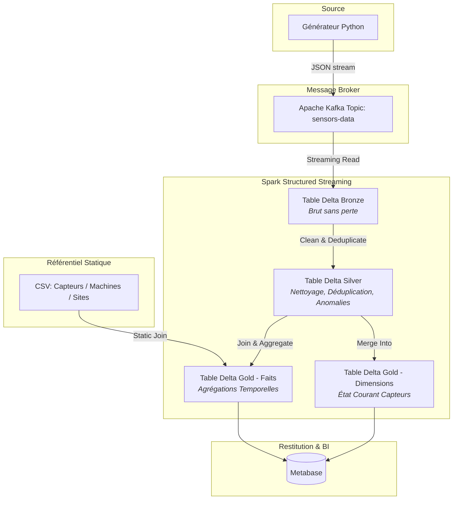

# Pipeline Big Data Temps Réel — Monitoring de Capteurs Industriels

Ce projet implémente un pipeline de traitement de données temps réel en **architecture Kappa** pour monitorer une flotte de capteurs industriels. 

---

## 📄 Présentation du Cas d'Usage
Le système simule un site industriel composé de plusieurs dizaines de capteurs (mesurant la température, la vibration et la pression) répartis sur différentes machines. Chaque capteur émet une mesure toutes les 1 à 3 secondes.

### Schéma des événements Kafka (JSON)
```json
{
  "event_id": "evt-9f3a1c2d",
  "capteur_id": "cpt-042",
  "machine_id": "m-07",
  "site_id": "site-lyon",
  "type_mesure": "temperature",
  "valeur": 78.4,
  "unite": "celsius",
  "qualite_signal": 0.97,
  "batterie_pourcentage": 63,
  "timestamp": "2026-07-08T10:15:32.104Z"
}
```

---

## 🛠️ Architecture du Pipeline



### Choix techniques de modélisation
*   **Format des tables :** Delta Lake (pour le support ACID, le Time Travel et les opérations `MERGE INTO`).
*   **Partitionnement :** *(À compléter : Spécifier les colonnes de partitionnement choisies, ex: partitionnement de la table Bronze/Silver par date ou par `site_id` / `type_mesure` et justifier le choix).*

---

## 🚀 Guide de Lancement

### Prérequis
*   Docker & Docker Compose
*   Python 3.x (pour le générateur d'événements)
*   Java/Scala & Spark local (si exécuté hors conteneur) ou environnement Docker Spark préconfiguré.

### 1. Démarrage de l'infrastructure
Pour lancer Kafka, Spark, Delta Lake et Metabase :
```bash
docker compose up -d
```
*(Optionnel : Décrire ici la liste des conteneurs démarrés et leurs ports associés)*

### 2. Référentiel Statique (Données de Référence)
Les fichiers suivants doivent être configurés à la racine du projet ou dans un dossier `/data` :
*   `capteurs.csv` :
    ```csv
    capteur_id,type_mesure,plage_nominale_min,plage_nominale_max,fabricant,date_installation,precision_capteur
    cpt-042,temperature,10,85,Siemens,2023-03-14,0.5
    cpt-017,vibration,0,12,Bosch,2022-11-02,0.1
    ```
*   `machines.csv` :
    ```csv
    machine_id,type_machine,ligne_production,criticité,date_mise_service,capacite_nominale,responsable_technique
    m-07,presse hydraulique,ligne-A,haute,2021-06-01,500,J. Dupont
    m-12,convoyeur,ligne-B,moyenne,2020-09-15,1200,S. Martin
    ```
*   `sites.csv` :
    ```csv
    site_id,nom,région,capacite_site,fuseau_horaire,responsable_site
    site-lyon,Lyon Usine 1,Auvergne-Rhône-Alpes,3000,Europe/Paris,M. Bernard
    site-nantes,Nantes Usine 2,Pays de la Loire,1800,Europe/Paris,L. Petit
    ```

### 3. Lancement du Générateur d'Événements
```bash
# Installation des dépendances (ex: kafka-python)
pip install -r generator/requirements.txt

# Lancement du générateur avec les paramètres souhaités
python generator/main.py --sensors 50 --frequency 2 --anomaly-rate 0.05
```

### 4. Soumission des Jobs Spark
Commandes pour soumettre les différents traitements de stream :
```bash
# Exemple de soumission pour le pipeline
spark-submit --packages io.delta:delta-core_2.12:2.4.0 spark_jobs/pipeline.py
```
*(Préciser ici si vous utilisez des scripts séparés pour chaque couche ou un pipeline global).*

---

## 📈 Preuves de Fonctionnement

### 1. Transit des données (Kafka ➔ Bronze ➔ Silver ➔ Gold)
*   **Kafka :** *(Insérer une capture d'écran du topic Kafka ou commande console consumer montrant les messages bruts)*
*   **Bronze (Brut) :** *(Copie d'écran ou commande montrant la structure et le contenu brut)*
*   **Silver (Filtré) :** *(Preuve de détection/marquage des anomalies, ex: température > 85°C)*
*   **Gold (Modélisé) :** *(Preuve du bon fonctionnement des agrégations et de la mise à jour de l'état courant)*

### 2. Fonctionnalités Delta Lake (Time Travel & Historique)
Sortie de la commande `DESCRIBE HISTORY` ou requête `VERSION AS OF` démontrant le fonctionnement du Time Travel :
```sql
-- Exemple de requête SQL de Time Travel
SELECT * FROM gold_sensor_state VERSION AS OF 1;
```
*(Insérer ici une preuve d'exécution réussie)*

### 3. Dashboard Metabase
*(Insérer une capture d'écran du dashboard Metabase montrant les KPIs en temps réel : nombre d'alertes par machine, moyenne de température glissante, état de la batterie des capteurs, etc.)*

---

## 🧠 Justifications Techniques

### Pourquoi l'architecture Kappa ?
*(Expliquer l'intérêt de n'avoir qu'un seul chemin de traitement temps réel pour ce cas d'usage sans couche batch séparée. Pourquoi le streaming est indispensable ici pour le monitoring industriel).*

### Gestion des Checkpoints
*(Décrire comment les checkpoints Spark Structured Streaming sont configurés et stockés pour garantir la tolérance aux pannes et le traitement "exactly-once").*

### Compaction des petits fichiers (Delta Optimization)
*(Expliquer le problème de surmultiplication des petits fichiers générés par le streaming continu et comment y remédier avec Delta, par exemple via OPTIMIZE et Auto-Compact).*

---

## ⚠️ Gestion des Incidents
*(Décrire ici un problème réel rencontré durant le développement : par exemple, un checkpoint corrompu, une erreur Out Of Memory (OOM) sur Spark, ou un problème de désynchronisation de schéma Delta Lake, et détailler comment vous l'avez résolu).*
